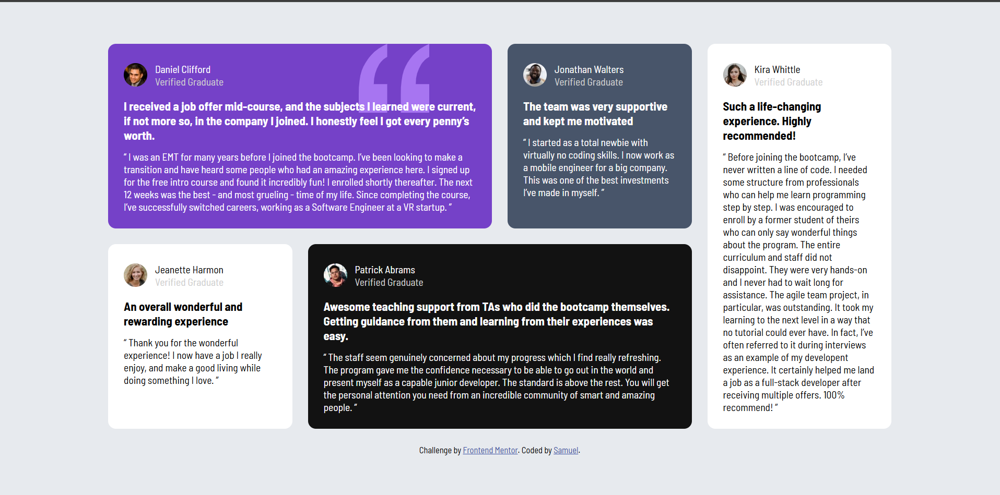
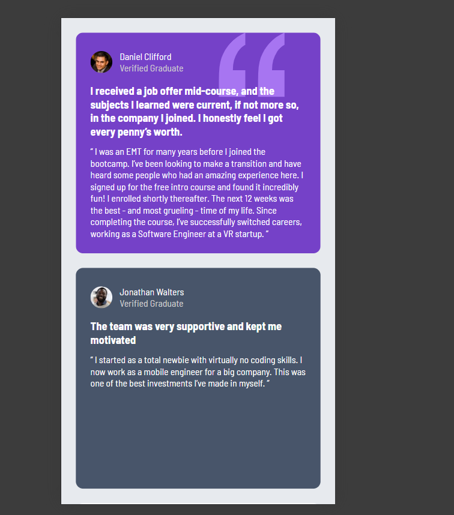

# Frontend Mentor - Testimonials Grid Section Solution

This is my solution to the [Testimonials grid section challenge on Frontend Mentor](https://www.frontendmentor.io/challenges/testimonials-grid-section-Nnw6J7Un7).

## Table of contents

- [Overview](#overview)
  - [The challenge](#the-challenge)
  - [Screenshot](#screenshot)
  - [Links](#links)
- [My process](#my-process)
  - [Built with](#built-with)
  - [What I learned](#what-i-learned)
  - [Continued development](#continued-development)
  - [AI Collaboration](#ai-collaboration)
- [Author](#author)
- [Acknowledgments](#acknowledgments)

## Overview

### The challenge

Users should be able to:

- View the optimal layout for the site depending on their device's screen size

### Screenshot

- Desktop
  

- Mobile
  

### Links

- Solution URL: [https://github.com/Samm24TT/testimonials-grid]
- Live Site URL: [https://testimonials-grid-beta-nine.vercel.app/]

## My process

### Built with

- Semantic HTML5 markup
- CSS custom properties
- Flexbox
- CSS Grid
- Mobile-first workflow

### What I learned

I learned css grid that is very useful for styling a webpage.

```css
.proud-of-this-css {
  grid-template-columns: repeat(4, 1fr);
  grid-template-rows: repeat(2, 1fr);
}
```

### Continued development

I will be continue level up my skills in web development by doing project at frontend mentor.

### AI Collaboration

I use Gemini for asking, not copy/paste I use it mostly for css and query

## Author

- Frontend Mentor - [https://www.frontendmentor.io/profile/Samm24TT]

## Acknowledgments

Very greatful to finish this project. I'll keep going.
